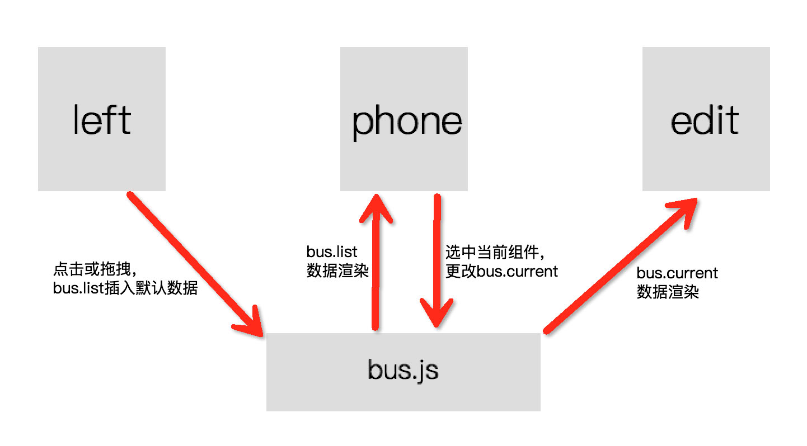

# 装修模板开发说明
## 目录结构

decoration

*  dist //build后的文件

*  src //开发文件
	*  assets //静态文件
		*  font //文字图标
		*  images //图片（包含图片文件&svg文件）
		*  js
			*  bus.js //用于组件通信
			*  common.js //公共js
			*  localStorage.js //本地缓存
			*  service.js //接口
	*  components //组件
		*  modules //公共模块
			*  imageChoice.vue //图片选择弹窗
			*  linkChoice.vue //连接选择弹窗
			*  modal.vue //弹窗（图片弹窗&连接选择弹窗均使用此组件为基础）
			*  pagination.vue //分页
			*  slider.vue //幻灯片
			*  tips.vue //提示
		*  parts //组件:每个文件夹均为一个组件，包含edit.vue(编辑区模板)、preview.vue(手机框预览组件)
			*  categories
				*  edit.vue
				*  preview.vue
		*  header.vue //头部工具条
		*  left.vue //左侧组件区
		*  phone.vue //手机预览区
		*  right.vue //右侧编辑区
*  App.vue
*  main.js

## 框架及插件使用
框架使用Vue2.0 [查看帮助文档](http://cn.vuejs.org/v2/guide/)

插件详见：package.json

## 起步
> npm run dev

## build
> npm run build

## 思路

## 技术难点
### 组件通信

使用一个空的 Vue 实例作为中央事件总线（详见：assets——js——bus.js）

	var bus = new Vue({
	    data: {
	        list: $.parseJSON(config.data) || [], //用于保存和渲染的数据
	        current: {
	            edit: null, //当前编辑元素编辑区模板数据
	            index: null //当前编辑元素索引
	        },
	    }
	})

### 用户信息传参

在index.html文件head内定义一个全局变量configs

	var configs = configs || {};
	var isDev = true; //是否是开发环境
	configs.shopId = 38; //店铺id
	configs.baseUrl = 'http://store.test.seatent.com'; //请求接口前缀
	configs.data = isDev ? window.localStorage['pageData'] : '[]' //用于渲染和保存的数据

## 接口说明
接口请求统一写在service.js 文件中

1、保存

	url: '/goods/appSaveDecoration',
	type: 'POST',
	data: {
        shopId: , //店铺id
        content: //保存内容
    },

2、连接选择

我的商品列表

	url: '/goods/appGoodsList',
	type: 'GET'

分组列表

	url: '/decorate/getGroupList',
	type: 'GET'

限时特卖列表

	url: '/decorate/getActivityList',
	type: 'GET'

装修页面列表

	url: '/decorate/getDecorationList',
	type: 'GET'

3、图片上传

	url: '/goods/appUploadShopPic',
	type: 'POST',
	cache: false,
    data: formData,
    dataType: 'JSON',
    processData: false,
    contentType: false,

## 如何开发新组件
1、在parts下新建一个文件夹，文件夹的名称及为组件的type名，文件夹包含两个文件（edit.vue、preview.vue）;

2、打开config.js，在文件顶部按照原有的组件格式引入edit.vue & preview.vue 文件

	import typePreview from './components/parts/新建组件文件名/preview'
	import typeEdit from './components/parts/新建组件文件名/edit'

3、在tags数组中添加一个新对象

	{
	    category: '类目名称',
	    list: [{
	        name: '新增组件名',
	        type: '新增组件type名（及步骤一中的文件夹名称）',
	        max: 1 //组件在当前页面最大添加个数
	    }]
	}

4、在defaultElement新增默认数据 
	
	type名: {
        name: 'type名',
        data: { //默认数据
            
        }
    }

5、在componentsPreview按照原有格式新增一个字段
	
	{
		新增type名：typePreview（步骤2中引入的typePreview）
	}

6、componentsEdit同步骤5

	{
		新增type名：typeEdit（步骤2中引入的typeEdit）
	}

## 温馨提示

一定要写注释

开发新组建时一定要以数据为驱动，通过改变数据来渲染页面，如果遇到问题就大家讨论，不要贸然改变这一思路

